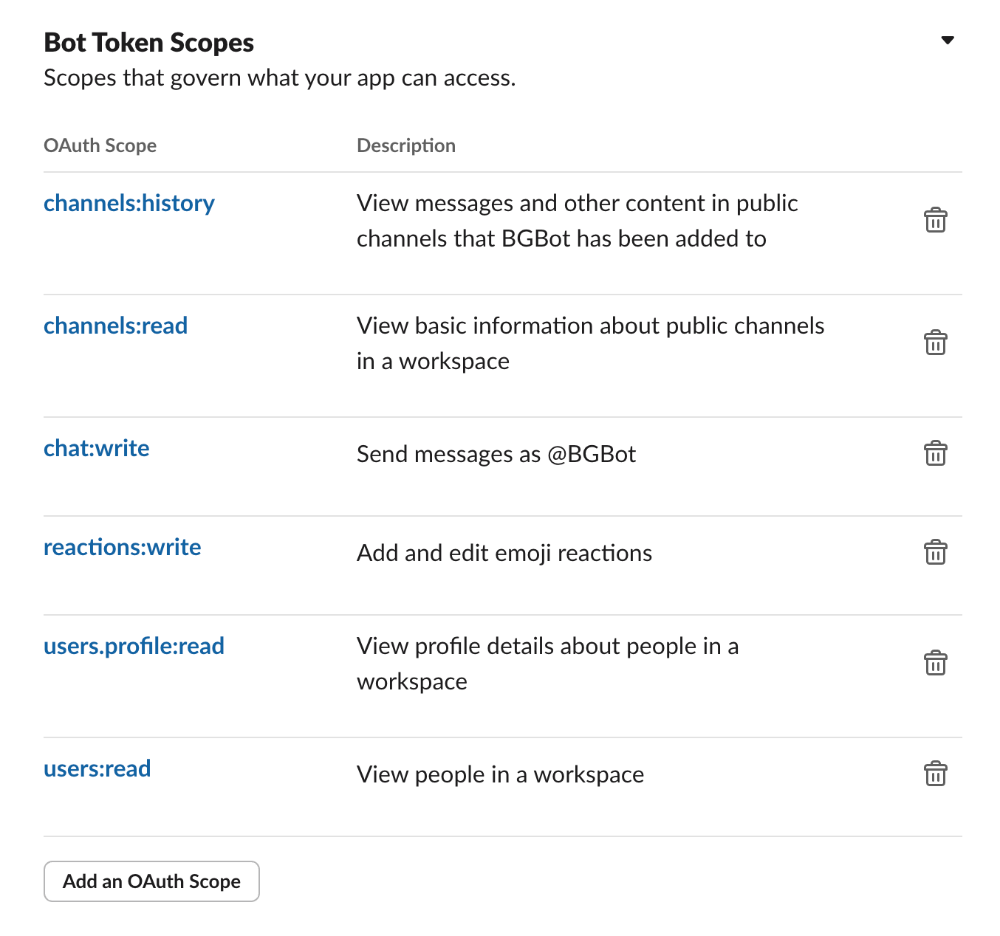
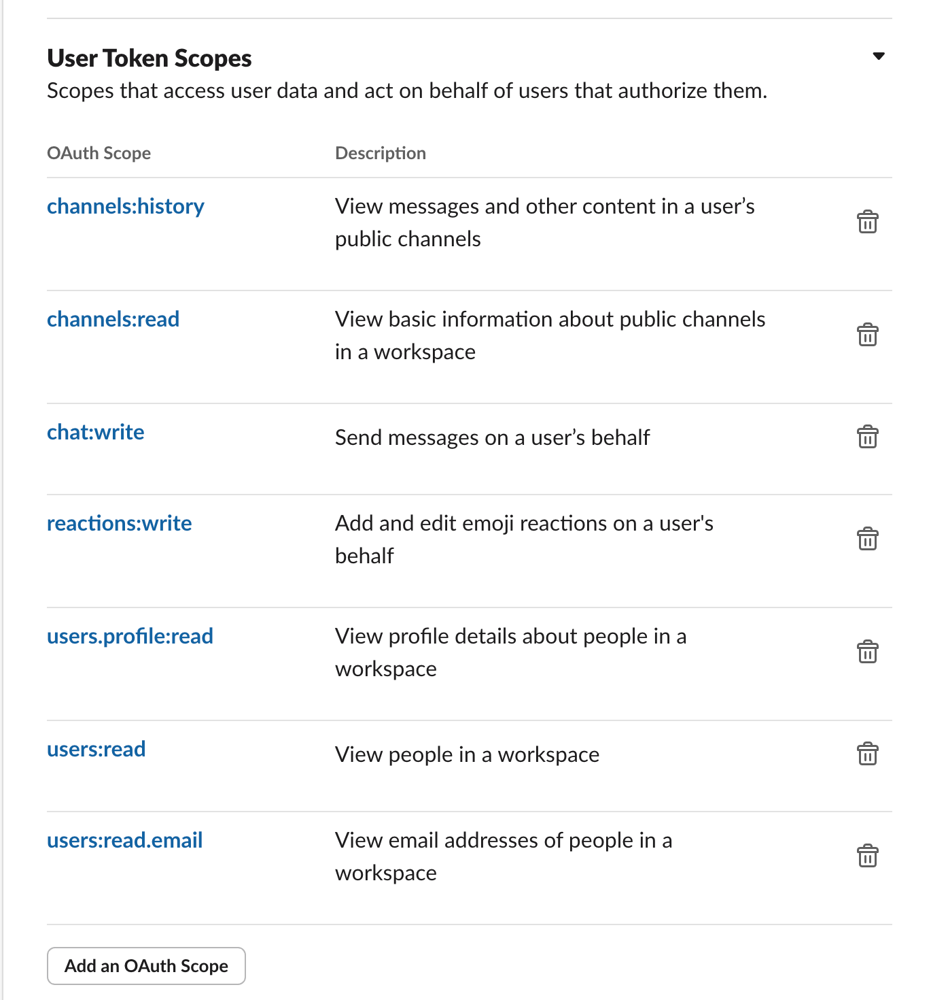

# @mcp-server/slack

This package provides a robust, type-safe Slack client designed for integration with AI agents, built on top of `@agentic/core`. It offers a suite of methods for interacting with the Slack API, all of which are exposed as AI-callable functions.

** It optimizes API response for less token usage. **
So, you can use it as a tool for AI agents without any additional processing.

## How to get Slack API Token

1. Go to https://api.slack.com/apps
2. Create a new app
3. Go to "OAuth & Permissions"
4. Set Scopes

-   bot scope

-   user scope

5. Copy the token

## Features

-   **AI-Ready:** All public methods are decorated with `@aiFunction`, making them instantly available to AI agents.
-   **Type-Safe:** Leverages `zod` to validate API responses, ensuring data integrity and providing strong type safety.
-   **Automatic Pagination:** Seamlessly handles pagination for fetching large datasets, such as retrieving all channels a user is a member of.
-   **Modern Asynchronous API:** Built with `async/await` and modern JavaScript features.

## Test Code (optional)

This package has a test code that tests the client. To run the test, you need to set the following environment variables. (`.env` file)

-   `SLACK_BOT_TOKEN`
-   `SLACK_TEAM_ID`
-   `__TEST_USER_ID`
-   `__TEST_CHANNEL_ID`
-   `__TEST_THREAD_TS`
